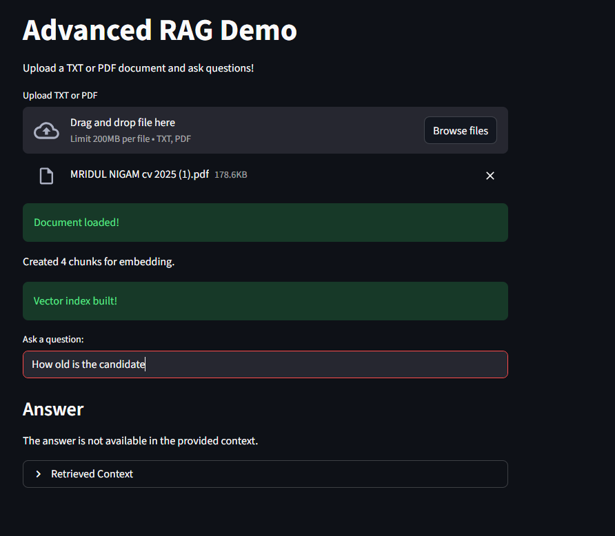
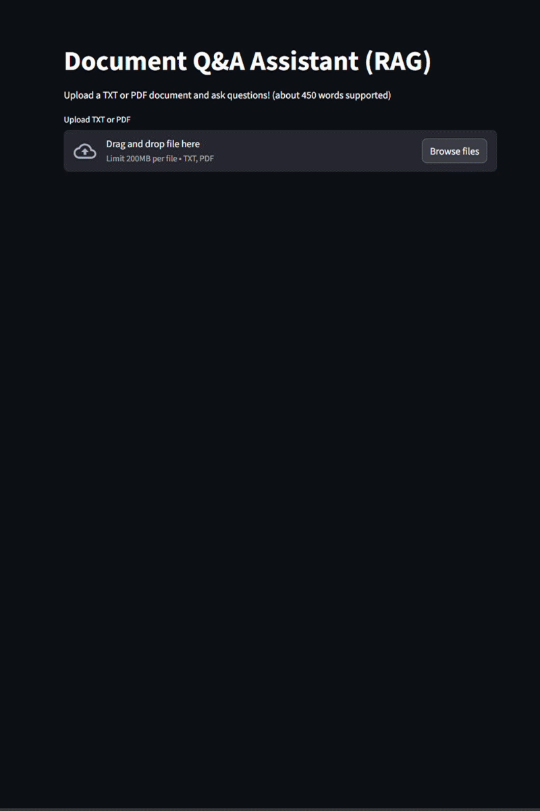

# Document Q&A Assistant (RAG) GEN-AI QA App


An **interactive Retrieval-Augmented Generation (RAG) application** built using **Python, FAISS, Streamlit, and AI Cafe APIs**.

The app allows users to **upload documents and ask questions**, and answers are generated **strictly using retrieved context from the document**.

---

# Live Application



Open the hosted app:

https://rag-genai.streamlit.app/

---

# Demo

Upload a document → Ask questions → Get context-grounded answers.

Example use cases:

**Transcript Analysis**

* Upload meeting transcripts
* Ask questions about decisions or discussion topics

**Resume Analysis**

* Upload a resume
* Ask questions about skills, experience, or projects


---

# Architecture

The application implements a **Retrieval-Augmented Generation pipeline**.

```
User Question
     ↓
Document Upload
     ↓
Text Chunking
     ↓
Embedding Generation
     ↓
FAISS Vector Index
     ↓
Similarity Search
     ↓
Optional Reranking
     ↓
Prompt Construction
     ↓
LLM Response
```

This ensures answers are **grounded in the uploaded document** rather than relying on model memory.

---

# Features

* Upload **TXT and PDF documents**
* Sentence-aware **text chunking**
* Embeddings via **AI Cafe embedding API**
* Fast vector search using **FAISS**
* Optional **reranking step**
* Context-grounded responses with **GPT-4.1**
* Interactive **Streamlit UI**
* View **retrieved context chunks**

---

# Project Structure

```
.
│
├── app.py
├── requirements.txt
│
├── examples
│   │
│   ├── transcript-example
│   │   ├── transcript.txt
│   │   └── app-screenshot
│   │
│   └── Resume-example
│       ├── Mridul CV 2024
│       └── app-Screenshot
```

---

# Example Workflows

## Transcript Example

Location:

```
examples/transcript-example/
```

Upload the transcript and ask questions such as:

* What topics were discussed?
* What conclusions were reached?
* What decisions were made?

Screenshots are provided in the example folder.

---

## Resume Example

Location:

```
examples/Resume-example/
```

Upload the resume and ask questions such as:

* What skills does the candidate have?
* What companies did they work at?
* What technologies are mentioned?

---

# Running Locally

## 1 Install Dependencies

```
pip install -r requirements.txt
```

## 2 Run Streamlit

```
streamlit run app.py
```

The application will open at:

```
http://localhost:8501
```

---

# Configuration

The application uses **HCLtech AI Cafe hosted APIs** and so is limited to 450 words of size.

Set your API key in **Streamlit Secrets**.

Example:

```
API_KEY=your_subscription_key
```

Used APIs:

Chat Model

```
gpt-4.1
```

Embedding Model

```
text-embedding-ada
```

---

# Tech Stack

Python
Streamlit
FAISS (Vector Database)
NumPy
Requests
PyPDF
HCL AI Cafe APIs

---

# Why RAG?

Large Language Models can sometimes generate incorrect information.

RAG improves reliability by:

* Retrieving relevant information from documents
* Providing the LLM with real context
* Generating answers grounded in that context


---

# License

This project is intended for learning and experimentation with **Retrieval-Augmented Generation systems**.
